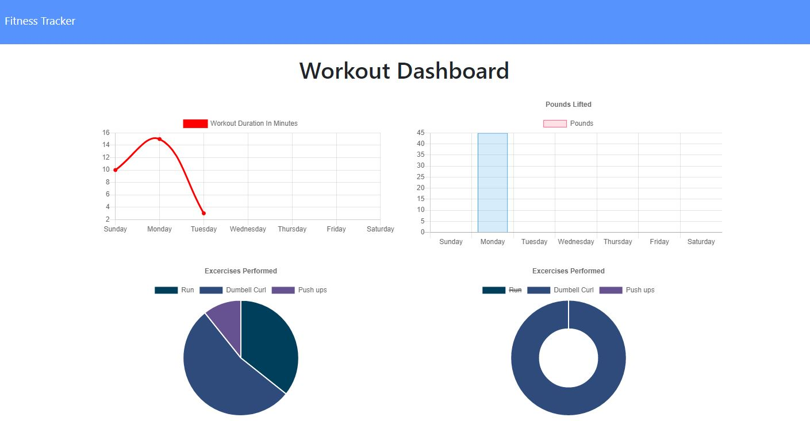

# Workout Tracker

## Table of Contents
- [Description](#descriptiongo)
- [Installation Instructions](#installgo)
- [Usage](#usagego)
- [Authors](#authorgo)
- [Deployed Links](#deployedgo)
- [Questions](#contactgo)
        
## Description

A fitness tracker where a user is able to view create and track daily workouts. The user can log multiple exercises in a workout on a given day. They are able to track the name, type, weight, sets, reps, and duration of exercise. For applicable exercise they can track the distance traveled.

## Installation Instructions

express, mongojs, morgan
## Usage

For individuals who want to track thier daily workouts.
## License

MIT License

## Authors

Shawn A. Rather

## Deployed

https://desolate-sea-26372.herokuapp.com/
## Questions

Refer to github or send email with any questions:

SAR-SA

sarsa.web.gmail.com
